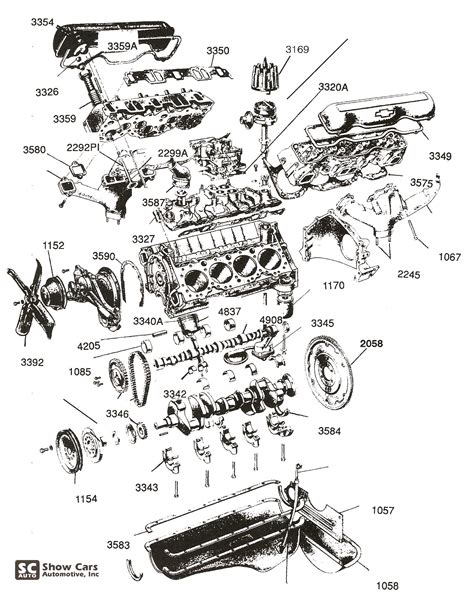
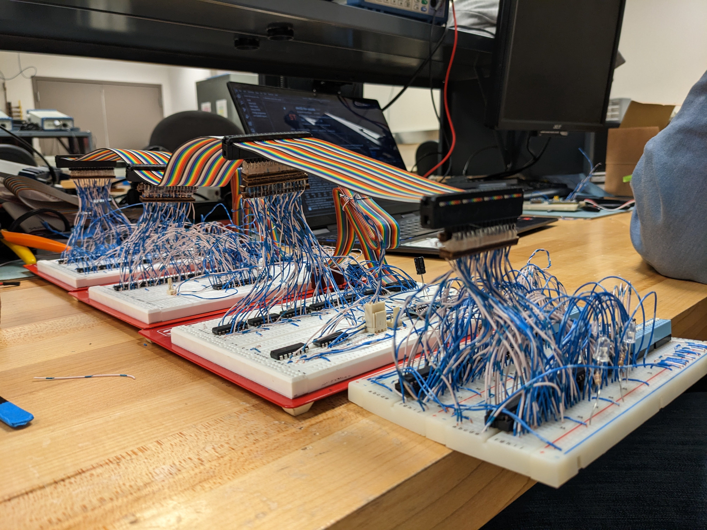

# Welcome to Schmorbium!

## SCMB-1
We are building SCMB-1 to provide an experience of learning to show computing and its intricacy to the world.

Computer systems, particularly those printed directly on silicon, often present an enigma to the uninitiated observer. Their operations seem inscrutable, especially when compared to mechanical systems where the functionality can often be discerned through meticulous observation. While this isn't inherently problematic for everyday users, we felt a desire to offer a glimpse into the inner workings of these digital systems.

While there are undeniable advantages to the System On a Chip (SOC) approach in digital design, we don't seek to challenge its merit. Rather, our project aims to emulate a RISC-V processor on hardware, compartmentalized into four distinct sections: the controller, register file, ALU, and the memory interface. Through an array of LEDs, digital displays, and other peripherals, we plan to visually elucidate how the processor executes code at an instruction level. We've christened our prototype the SCMB-1.

Our inspiration stems from the ways we deconstruct mechanical systems, separating components to facilitate a more intuitive grasp of their operations (refer to Image 1). With this philosophy, SCMB-1 emerges as an amplified rendition of a RISC-V Processor, a fusion of detailed schematics and mechanical cutaway demonstrations. A remarkable quality of digital systems is their ability to function even when components are spread out; as long as the wire bus connects them. This flexibility allows us to stretch what would conventionally be confined within a square inch and magnify it over a 2 square foot display. With minimal tweaks to clock timings, the system remains operational. As it functions, we can integrate cutaway-like features, enabling users to witness live operations—for instance, observing two register values being funneled into the ALU and the resulting output.

image 1

As a prelude to SCMB-1, we constructed a 16-bit ALU entirely from discrete logical components (see Image 2). This endeavor taught us several lessons:

1. Managing 16-bit busses is cumbersome.
    a. The RISC-V processor is designed for 32 bits.
    b. The RISC-V processor requires significantly more busses than the ALU.
2. Building a full processor from discrete components would rapidly escalate in costs, both in terms of PCB real estate and component expenditures.
3. Debugging with discrete components can be intensely challenging.

image 2

Given these insights, we opted to emulate the RISC-V processor using microcontrollers instead of crafting an entirely original system. This strategic pivot also enables us to prioritize the user's experience, alleviating the complexities of embedding IO into a multifaceted logical assembly.