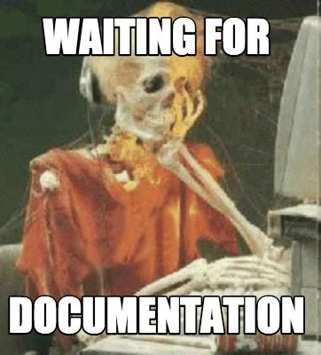

# SCMB-01: 3D Breakout
Alex Guymon, Daniel Nelson, Isaac Christensen

## Midterm Review

### Small review

4 separate PCBs each with their functionally implemented on STM32 microcontrollers. With a serialized connection (defined later) the controllers broadcast the information they "generate" (e.g. controller with broadcast ALU opcode, regfile the register values, etc.) 

### Hardware Progress

General rev 1.0 knowledge: 
- Always have Power Rail LEDs, for debugging. 

Memory IO Board: 
- Blank signal left floating, But for some reason the blank signal would be tied to VCC internally. :( 
- Isaac lost the smallest quartz clock resonator to ever exist so we were not able to test the onboard USB-UART. 

ALU/RegFile: 
- Have to explicitly add layers to the top silkscreen layer to relish in the *glory* of Schmorby on a PCB. (Fusion was rude and defaulted to importing images to a non-silkscreen layer) 

Controller: 
- We were missing a few labels on the indicator LEDs

<!-- Insert Our PCB assembly Pictures -->
PCB Assembly: 
We cut stencils out of thin Laminator sheets. Using the stencils we applied the solder paste, placed our components, then threw it in the oven for 15 minutes. *Bing Bang Boom, we got our selves a <s>cake</s> PCB*

For Next time: We need to make sure the stencils accommodate the Kerf of the Laser. (Possibly more, our pads had too much solder so it took quite a bit of clean up to get them working. But they did work in the end.)

<video width="500" controls poster="images/driverDemoPoster.png">
  <source src="videos/driverDemo.mp4" type="video/mp4">
  Your browser does not support the video tag.
</video>

Revision 2:
- In the mail, and should arrive soon.
- Additions
  - More Labels of the LEDs
  - small LCD touch Screen on the memory IO Board
  - Power Indicator Lights
  - LED `Blank` signal now on a PWM Channel for LED brightness control
  - All the silk screen layers this time for on board graphics

### Firmware Progress

Lots of progress on the communication protocol between boards
- Protocol Defined, and finally completely ported to C++
  - Documentation coming soon™
<!-- TODO: Insert the picture of our board with the chicken scratch docs on the wall -->
- Common library implemented and and tested.
  - Only alerts the main loop to packets flagged for that board, and will silently forward other packets

<video width="600" controls poster="images/ibcDemoPoster.png">
  <source src="videos/ibcDemo.mp4" type="video/mp4">
  Your browser does not support the video tag.
</video>

Lots of progress on the Computer-Board Communication protocol
- Protocol developed
- Just about ready to test
- Memory altering commands over uart. 
  - Should I add data verification? probably, that's a later Isaac problem

### Software Progress
Compiler: 
- Working on Linux
<!-- TODO: add some more compiler stuff? -->

GUI:
- Compiled fork of Simulator
- Start to work on integrating the compiler and the boot loader into the program.
<!-- TODO: Add some pictures of the simulator -->
BootLoader:
- Working on Linux
- Pending On the Computer Board Communication completion and testing

**Web Documentation**: (*hey look that's this thing!*)
- Displays markdown on the web page
  - Each Page can be link (Yes that's a new feature, I forgot it when I first wrote the page.....)
  - Special Json parser that take Packet Data encoded in a Json and adds a nice visualization of the data and the data's label and description

  

<!--  -->

- Now all we need to do is write the documentation, the easiest part as we all now. 

Other Memes Isaac wanted to Add but did not have the space :)

<!--  -->

