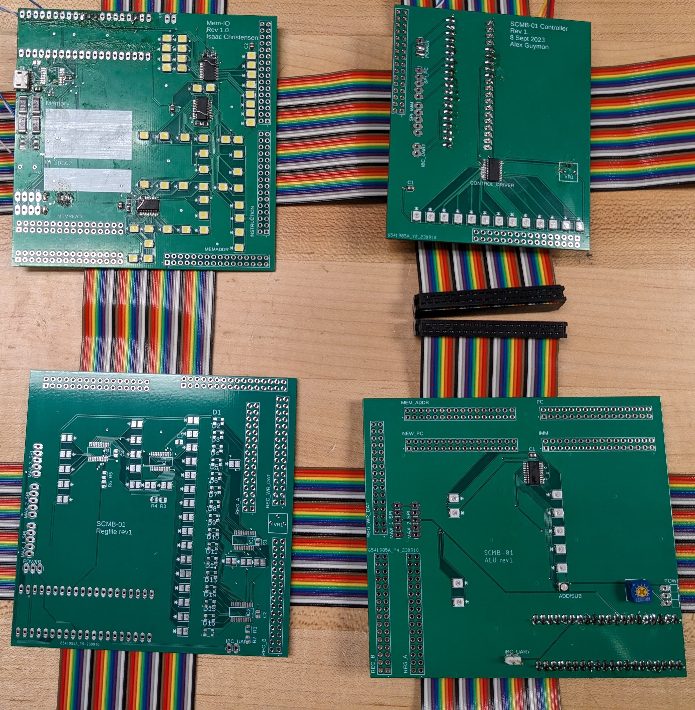

# SCMB-01: 3D Breakout - November Review
Alex Guymon, Isaac Christensen, Daniel Nelson

## Pitch

A computer made of computers. We have broken the function of the RISC-V architecture up into distinct portions to help open the function of a computer processor to the eyes of the average person. On each portion, we have attached LEDs, 7-segment displays and layouts on the board to show how the processor is determining the outcome of each instruction. We have also added the ability to slow down the processor dynamically so we can show one instruction at a time and show what elements of the processor are doing, such as what ALU operation is happening.

## Final PCB Revision

The order was placed a little behind (Monday, instead of last Friday) due to last minute adding a 5th board for a GPU. This should still leave us plenty of time to populate and integrate everything though, because everything has already been tested on the rev 2 boards.

## Yes, a GPU

We have a display that we are driving over SPI. But a display is *actually, kind of*, a **lot** of data. So, Isaac decided that it would be best to add a 5th board for specifically driving the display.

